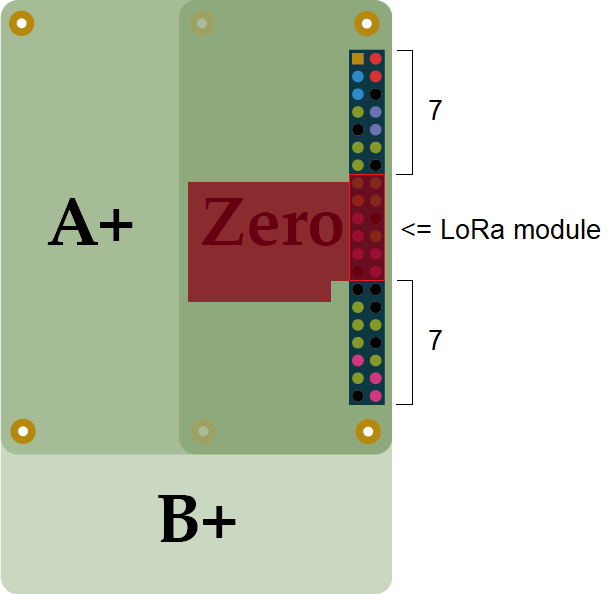

# lora2mqtt
Intigrate and configure LoRa Devices. Currently, this Project contains a backend driver for the SX1278 Chip
on a specific custom Module. Together with a simple but functional web frontend this project provides a complete
configutaion suite for compatible devices.

## Installation
This software is meant to run on a Raspberry Pi 3 or newer with GPIO extention pins. The LoRa receiver module must
be attached in the shown orientation and position. Please power down the pi when attaching or detaching the module 
to prevent damage to the module or the pi.



To download and install this software you can clone this repo into a directory of your choice and run install.sh:

```bash
git clone https://github.com/Alex-W4/lora2mqtt.git
cd lora2mqtt
sudo bash install.sh
```

All necessary dependencies should install automatically. For manual installation of the required dependencies use the following
commands:

```bash
sudo apt install pigpio nodejs mosquitto libpaho-mqttpp-dev libpaho-mqtt-dev npm -y
sudo -i npm install forever -g
```

Reboot the pi to complete the installation.

On clean installations the mqtt broker `mosquitto` needs to get configured. For a minimal usable broker the installation script adds a minimal
configuration to the mosquitto config in `/etc/mosquitto/conf.d/lora2mqtt`. Delete or change this file if your mqtt broker is properly
configured!

## Usage
A Webserver is hosted under the ip of the raspberry pi and port `80` by default. The port can be changed in `/etc/lora2mqtt/config.json`.

## Manual Build
The node addon can be build manually with `cmake-js`. After installation of cmake-js the addon can be manually compiled in the lora directory with:
```bash
cmake-js build
```

## TODO
There are still some features missing and planed in future updates like:
* Documentation
* English language support
* Settings menu
* User authentication
* Further interface documentation
* Support for more modules